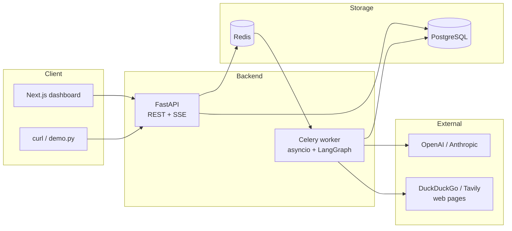
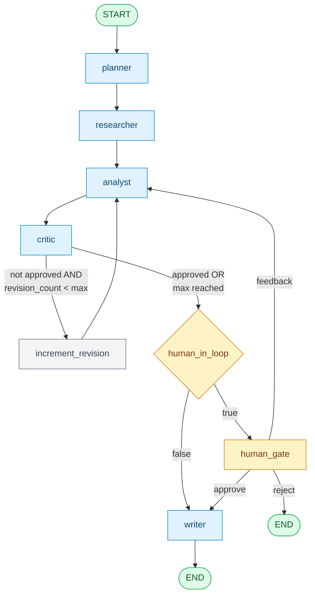
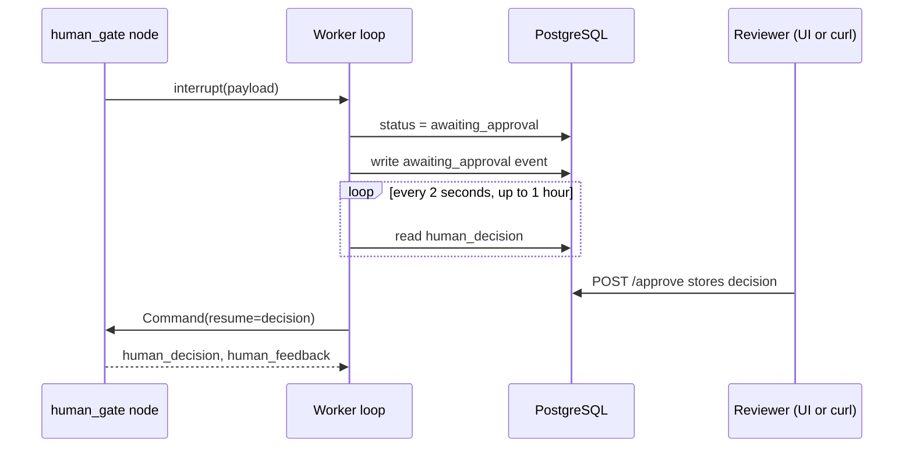
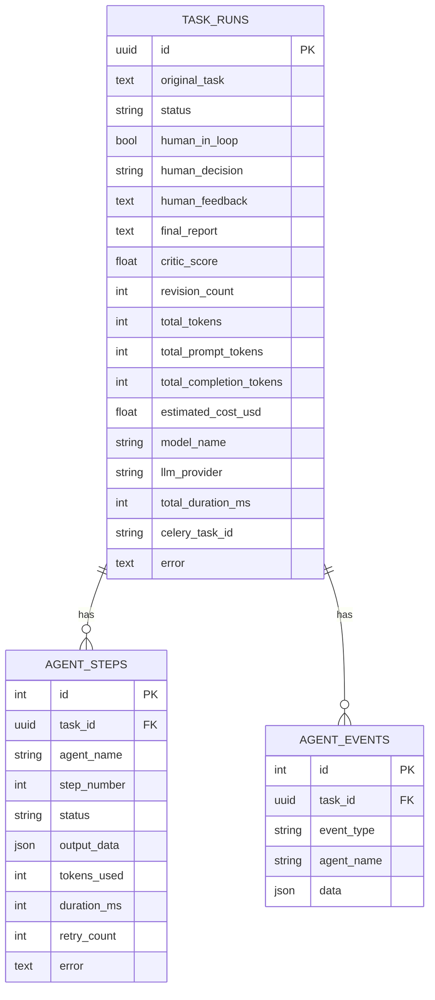

# Critique Architecture

Critique is a multi-agent research pipeline built on [LangGraph](https://github.com/langchain-ai/langgraph). One task goes in. The graph plans it, researches the web, analyses the findings, critiques its own analysis, optionally waits for a human, and writes a cited report.

This document describes how the system is put together. For setup and usage, see [README.md](README.md).

## Contents

1. [System components](#system-components)
2. [The graph](#the-graph)
3. [Nodes](#nodes)
4. [Routing rules](#routing-rules)
5. [Shared state](#shared-state)
6. [Human-in-the-loop](#human-in-the-loop)
7. [Execution and streaming](#execution-and-streaming)
8. [Persistence](#persistence)
9. [Error handling and retries](#error-handling-and-retries)
10. [Cost tracking](#cost-tracking)
11. [Security notes](#security-notes)
12. [Known design gaps](#known-design-gaps)

---

## System components



| Component | Role |
|---|---|
| FastAPI | Accepts tasks, serves status, streams events, records human decisions. It never runs the graph. |
| Celery worker | Runs the graph for one task per job. Writes every step and event to PostgreSQL. |
| Redis | Celery broker and result backend. Holds only the job queue. |
| PostgreSQL | Source of truth for tasks, steps, events, reports and metrics. |
| Next.js | Dashboard for creating tasks, following progress and approving. |

The API and worker share no memory. They communicate only through Redis (job hand-off) and PostgreSQL (progress and human decisions). This is why several API replicas can serve the same task stream.

---

## The graph



The graph is defined in `app/agents/graph.py` with seven nodes: `planner`, `researcher`, `analyst`, `critic`, `human_gate`, `writer` and the small helper `increment_revision`. It is compiled with a `MemorySaver` checkpointer so `interrupt()` can pause and resume it.

---

## Nodes

| Node | Tools | Temp | Output keys | On failure |
|---|---|---|---|---|
| `planner` | none | 0.2 | `subtasks` | Falls back to `[original_task]` |
| `researcher` | `web_search`, `url_reader` | 0.1 | `research_results` | Records "Research failed." for that subtask and continues |
| `analyst` | `calculator`, `file_reader` | 0.3 | `analysis` | Stores `"Analysis failed: <error>"` |
| `critic` | none | 0.1 | `critic_score`, `critic_approved`, `critic_feedback` | Score 0.5, approved, so the run continues |
| `human_gate` | none | n/a | `human_decision`, `human_feedback` | Auto-approves after a 1 hour poll timeout |
| `writer` | none | 0.4 | `final_report`, `status` | `final_report=None`, status `failed` |

### Planner

Asks the model for JSON `{"subtasks": [...]}` with 3 to 6 researchable items. Markdown code fences around the JSON are stripped before parsing.

### Researcher

Processes subtasks sequentially. For each one it runs a tool-calling loop of at most 6 model turns. `web_search` results (up to 3 per call) and successful `url_reader` fetches are collected as sources, capped at 10 per subtask. The final model message becomes the subtask summary.

### Analyst

Receives the formatted research plus, if present, feedback. The feedback is `human_feedback` when set, otherwise `critic_feedback`. The prompt asks it to address every point. The loop allows at most 4 model turns with `calculator` and `file_reader`.

### Critic

Returns `{score, approved, feedback, gaps}` as JSON. The model's own `approved` boolean is used. `CRITIC_APPROVAL_THRESHOLD` (default 0.75) only decides when the model omits `approved`.

### Writer

Writes a report with an executive summary, sections and recommendations. After the model call, code appends a deduplicated `## Sources` list (up to 20 links) built from the research results, so source links come from tool output and not from model text. If `revision_count >= MAX_REVISIONS` the report is prefixed with a note and the status is `best_effort`.

---

## Routing rules

```python
def route_after_critic(state):
    if not state.critic_approved and state.revision_count < MAX_REVISIONS:
        return "analyst"          # via increment_revision
    return "human_gate" if state.human_in_loop else "writer"

def route_after_human_gate(state):
    if state.human_decision == "reject":   return END
    if state.human_decision == "feedback": return "analyst"
    return "writer"
```

With the default `MAX_REVISIONS=3`, the analyst can run up to four times from critic loops: the first pass plus three revisions. Human feedback loops go back to the analyst without incrementing `revision_count`.

---

## Shared state

Every node reads and returns slices of one `AgentState` TypedDict (`app/agents/state.py`).

| Group | Keys |
|---|---|
| Identity | `task_id`, `original_task` |
| Planner | `subtasks` |
| Researcher | `research_results` (list of `{subtask, summary, sources}`) |
| Analyst | `analysis` |
| Critic | `critic_score`, `critic_feedback`, `critic_approved` |
| Revision | `revision_count` |
| Human | `human_in_loop`, `human_decision`, `human_feedback` |
| Output | `final_report` |
| Control | `status`, `active_agent` |
| Usage | `tokens_used`, `prompt_tokens_used`, `completion_tokens_used` |
| Reducers | `errors` (append-only list), `messages` (LangChain `add_messages`) |

---

## Human-in-the-loop



- Enabled globally with `HUMAN_IN_LOOP=true` or per task with `"human_in_loop": true`.
- The interrupt payload carries the critic score and a 500-character preview of the analysis.
- Decisions are `approve`, `reject`, or `feedback` (text required).
- If no decision arrives within one hour (`_HUMAN_POLL_TIMEOUT = 3600`), the worker resumes with `approve`.
- A decision submitted when the task is not awaiting approval returns HTTP 409.

---

## Execution and streaming

1. `POST /tasks` stores a `task_runs` row with status `pending`, enqueues the Celery job `critique.run_graph` and returns the `task_id`.
2. The worker runs `asyncio.run(_run_graph_async(...))`. It builds the graph with a fresh `MemorySaver` and iterates `graph.astream(..., stream_mode="updates")`.
3. For each finished node it writes an `agent_steps` row, updates `task_runs.status`, and writes `agent_start` and `agent_complete` events to `agent_events`.
4. `GET /tasks/{id}/stream` polls `agent_events` and pushes new rows to the client with `sse-starlette`.
5. After the graph ends, the worker computes cost, stores the report and metrics, and writes `task_complete`. On an unhandled exception it stores the error and writes `task_failed`.

### Event types

| Event | Emitted when |
|---|---|
| `agent_start` | A node's output has been received (emitted just before its step is saved) |
| `agent_complete` | The step was saved; includes token count and status |
| `agent_error` | An agent failed |
| `awaiting_approval` | The graph hit the human gate |
| `task_complete` | The graph finished; includes tokens, cost and duration |
| `task_failed` | An unrecoverable error occurred |

Because events are written after a node finishes, `agent_start` and `agent_complete` arrive back to back. The timeline shows order, not live per-agent duration.

### Task status values

`pending`, `planning`, `researching`, `analyzing`, `critiquing`, `awaiting_approval`, `writing`, `complete`, `best_effort`, `failed`, `cancelled`.

---

## Persistence



The stack is async SQLAlchemy 2.x with the `asyncpg` driver. Schema changes are managed by Alembic (`alembic/versions`, three migrations). The worker creates its own engine with `NullPool` for each job, because every job runs inside a fresh `asyncio.run()` call.

---

## Error handling and retries

Each LLM-calling function is wrapped with `tenacity`:

```python
@retry(stop=stop_after_attempt(3),
       wait=wait_exponential(multiplier=1, min=1, max=8),
       reraise=True)
```

After the third failure each node uses its fallback from the [Nodes](#nodes) table. The graph keeps moving instead of stopping. Only the writer's failure, or an exception outside a node, marks the task `failed`.

Trade-off: the run is resilient, but a wrong API key can produce a finished task with a thin report. Failures are recorded in the `errors` state list and the worker log.

---

## Cost tracking

Each node adds the model's `usage_metadata` (input, output and total tokens) to the running totals in state. At the end the worker computes:

```
cost = (prompt_tokens * input_price + completion_tokens * output_price) / 1,000,000
```

Prices live in `MODEL_PRICING` in `app/core/constants.py` (for example `gpt-4o-mini` at 0.15 input and 0.60 output USD per million tokens). A model missing from the table is priced at 3.00 and 15.00. The result is an estimate, stored in `task_runs.estimated_cost_usd` together with `model_name` and `llm_provider`.

---

## Security notes

- Authentication is optional. Set `API_KEY` and clients must send `X-API-Key`. The SSE endpoint also accepts `?api_key=` because browser `EventSource` cannot set headers. Query-string keys can end up in logs, so prefer a reverse proxy for production.
- With `API_KEY` empty, every endpoint is open, including task creation, which spends LLM money. Do not expose an unauthenticated instance to the internet.
- `url_reader` fetches any URL the model chooses and has no block on private or internal addresses, so it is open to server-side request forgery (SSRF). Run it only in trusted networks, or add an allow or deny list before public use.
- Fetched page text goes into model prompts. A malicious page could try to steer the agents (prompt injection). The agents only have read-oriented tools, which limits the impact.
- CORS is limited to the origins in `CORS_ORIGINS`.

---

## Known design gaps

- Human-gate state lives in the worker's `MemorySaver`. A worker restart during `awaiting_approval` loses that task.
- The Researcher is sequential, so total time grows with the number of subtasks.
- After human feedback, `human_feedback` stays in state, so later analyst runs keep using it and ignore new critic feedback.
- Rejecting a task ends the graph without a report. The `human_gate` node leaves `status` as `awaiting_approval`, and the worker reads the final status from state. By reading the code, the stored status may therefore not be `failed`. This has not been tested.
- With the Celery `solo` pool (needed on macOS), cancelling cannot interrupt a running graph.
