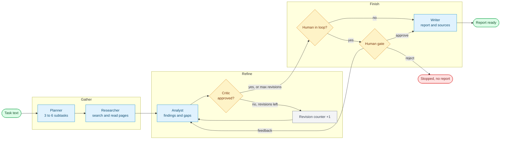
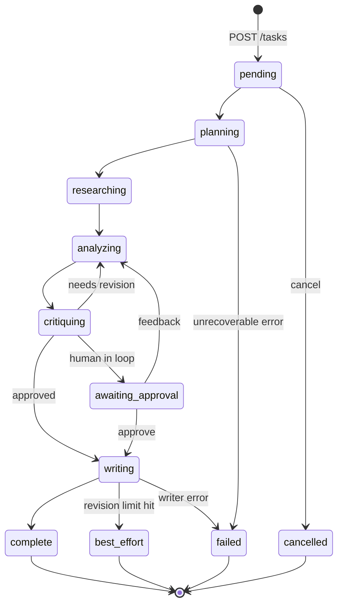
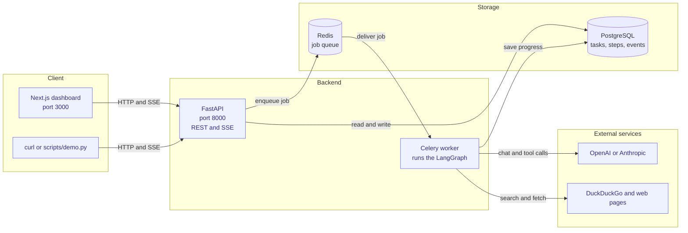
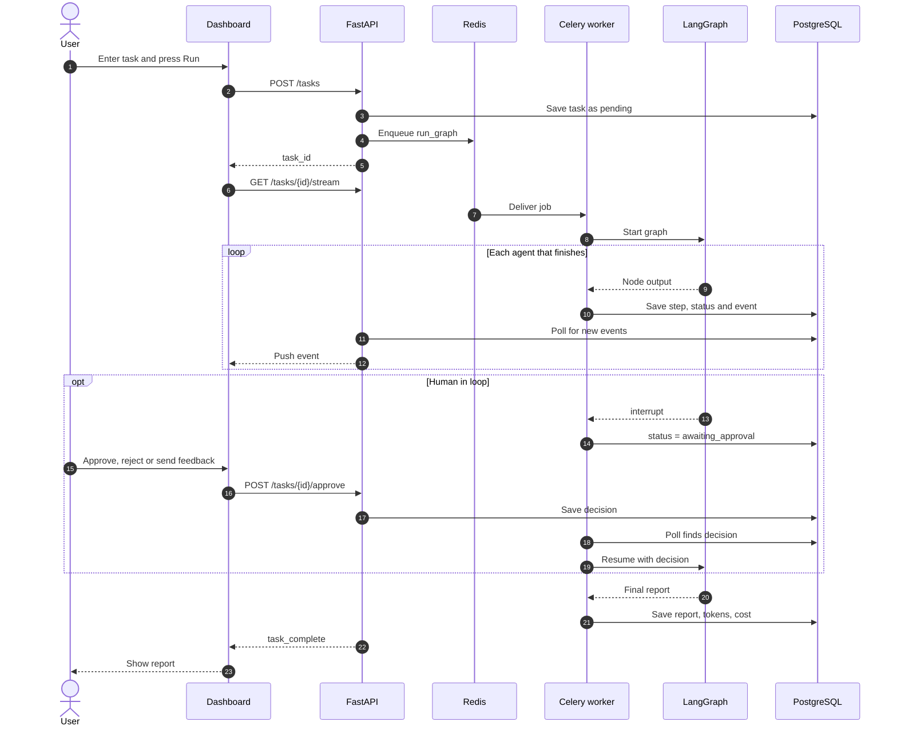
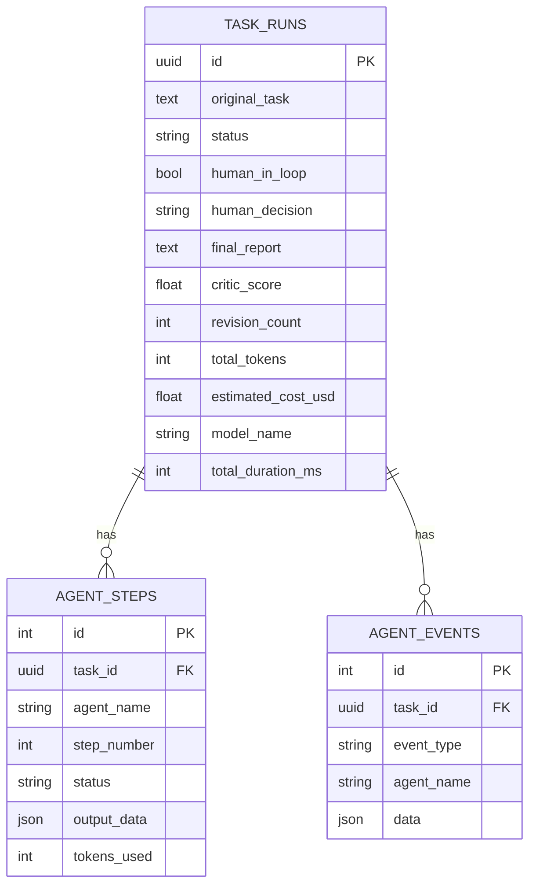

<div align="center">

# Critique

**A team of AI agents that turns one research question into a cited report.**


</div>

---

## Overview

You describe a research job in plain English. Critique breaks it into smaller questions, searches the web, writes an analysis, lets a second agent critique that analysis, and then produces a Markdown report with source links.

You can follow each step live in the dashboard, pause the run to approve or redirect it, and see the token count and estimated dollar cost of every run.

Example request:

> Research India's UPI-led fintech market and identify the top 3 investment opportunities for 2025-26. Cover market size, key players such as PhonePe, Paytm and Google Pay, and the RBI/NPCI regulatory environment.

**At a glance**

| Capability | Detail |
|---|---|
| Pipeline | Planner, Researcher, Analyst, Critic, optional Human gate, Writer (built on LangGraph) |
| Quality loop | The Critic can send the analysis back for rework up to 3 times |
| Human review | Optional pause before the final write: approve, reject, or send feedback |
| Live progress | Server-sent events (SSE) streamed to the dashboard |
| Research tools | DuckDuckGo search and page reader, no search key needed. Tavily is optional |
| LLM providers | OpenAI or Anthropic, switched with one environment variable |
| Tracking | Tokens and estimated USD cost per run, stored in PostgreSQL |
| Export | Report as Markdown or JSON |

---

## Contents

1. [Pipeline flow](#pipeline-flow)
2. [Task lifecycle](#task-lifecycle)
3. [Architecture](#architecture)
4. [What happens when you press Run](#what-happens-when-you-press-run)
5. [Sample tasks (India)](#sample-tasks-india)
6. [Setup](#setup)
7. [Using the API](#using-the-api)
8. [Configuration](#configuration)
9. [Troubleshooting](#troubleshooting)
10. [Tests](#tests)
11. [Known limitations](#known-limitations)
12. [Project layout](#project-layout)

---

## Pipeline flow

Every task runs through the same LangGraph. Solid arrows are the normal path. The loops are the revision cycle (Critic to Analyst) and the human feedback cycle.



### The agents

| Agent | Tools | Responsibility | On failure |
|---|---|---|---|
| Planner | none | Splits the task into 3 to 6 researchable subtasks (JSON) | Treats the whole task as one subtask |
| Researcher | `web_search`, `url_reader` | Searches and reads pages for each subtask, up to 6 tool calls each | Marks that subtask "Research failed" and moves on |
| Analyst | `calculator`, `file_reader` | Writes findings, patterns, gaps and conclusions, up to 4 tool calls | Stores an "Analysis failed" message |
| Critic | none | Returns a score, an approved flag and feedback | Approves by default so the run does not stall |
| Human gate | none | Pauses the graph with LangGraph `interrupt()` | Auto-approves after 1 hour |
| Writer | none | Writes the report; code then appends a numbered `## Sources` list | Task is marked `failed` |

Every LLM call is retried up to 3 times with exponential backoff (1 to 8 seconds).

### How the revision loop decides

- The Critic's own `approved` flag decides. `CRITIC_APPROVAL_THRESHOLD` (0.75) is only used if the model leaves that field out.
- If the analysis is not approved and fewer than `MAX_REVISIONS` (default 3) cycles have run, the feedback goes back to the Analyst.
- Once the limit is reached the Writer runs anyway. The report starts with a note and the task status is `best_effort` instead of `complete`.

---

## Task lifecycle

The `status` field on a task moves through these values.



---

## Architecture



Agent runs take minutes, so they run in a Celery worker and not inside the API process. The worker writes progress rows to PostgreSQL, and the API streams those rows to browsers by polling the table. Because PostgreSQL holds the progress instead of worker memory, more than one API server can stream the same task.

Design details are in [ARCHITECTURE.md](ARCHITECTURE.md).

---

## What happens when you press Run



### Data model



---

## Sample tasks (India)

Paste any of these into the Task Description box at `http://localhost:3000/tasks/new`.

| Theme | Task |
|---|---|
| Fintech | Research India's UPI-led fintech market and identify the top 3 investment opportunities for 2025-26. Cover market size, key players such as PhonePe, Paytm and Google Pay, and the RBI/NPCI regulatory environment. |
| Electric vehicles | Analyse the Indian electric two-wheeler market. Compare Ola Electric, Ather Energy, TVS and Bajaj on market share, pricing and charging infrastructure, and explain how the FAME-II and PM E-DRIVE subsidies affect growth. |
| Quick commerce | Compare Blinkit, Zepto and Swiggy Instamart. Cover dark store economics, unit economics, funding rounds and the 3 biggest risks for investors in tier-1 Indian cities. |
| Agritech | Evaluate agritech opportunities in India for 2025. Cover Agri Stack, e-NAM, drone adoption and farmer-producer organisations, and name the top 3 startups to watch and the main barriers to scale. |
| Solar manufacturing | Research India's solar manufacturing sector under the PLI scheme. Include 2030 installed-capacity targets, major players such as Adani Solar, Tata Power and Waaree, and the effect of import duties. |
| Digital health | Assess India's digital health market under the Ayushman Bharat Digital Mission. Cover market size, telemedicine players, ABHA adoption and data-privacy rules under the DPDP Act. |

More examples are in [`data/sample_task.txt`](data/sample_task.txt).

Tip: specific tasks give better reports. Name the market, the time frame, the companies, and the output you want.

---

## Setup

### Requirements

| Tool | Version | Check |
|---|---|---|
| Python | 3.11 | `python3.11 --version` |
| Node.js | 18 or newer | `node -v` |
| PostgreSQL | 16 | `psql --version` |
| Redis | 7 | `redis-cli ping` prints `PONG` |
| LLM key | OpenAI or Anthropic | from the provider's dashboard |

### Option A: run natively

```bash
# 1. Python environment
python3.11 -m venv .venv
source .venv/bin/activate
pip install -r requirements.txt

# 2. Database (once)
psql -d postgres -c "CREATE ROLE critique LOGIN PASSWORD 'critique';"
psql -d postgres -c "CREATE DATABASE critique OWNER critique;"

# 3. Configuration
cp .env.example .env
```

Edit `.env` to use OpenAI and local Redis:

```ini
LLM_PROVIDER=openai
OPENAI_API_KEY=sk-your-key-here

# Native run: Redis is on localhost, not the Docker hostname "redis"
CELERY_BROKER_URL=redis://localhost:6379/0
CELERY_RESULT_BACKEND=redis://localhost:6379/0
```

Create the tables and start the three processes, each in its own terminal:

```bash
# Once
alembic upgrade head

# Terminal 1: API
uvicorn app.main:app --port 8000

# Terminal 2: worker
celery -A app.workers.celery_app worker --pool=solo --loglevel=info

# Terminal 3: dashboard
cd frontend
cp .env.example .env.local
npm install
npm run dev
```

| URL | Purpose |
|---|---|
| http://localhost:3000 | Dashboard |
| http://localhost:8000/docs | Swagger API docs |
| http://localhost:8000/health | Health check and active LLM provider |

Notes:

- Use `--pool=solo` on macOS. The default prefork pool fails there with `ValueError: not enough values to unpack`. On Linux you can drop the flag and use `--concurrency=2`.
- The API and worker read `.env` only at startup. Restart both after editing it.

### Option B: Docker Compose

```bash
cp .env.example .env
# set LLM_PROVIDER and your API key in .env
docker compose up --build                       # db, redis, api, worker
docker compose --profile frontend up --build    # also starts the dashboard
```

Inside Docker the `db` and `redis` hostnames in `.env.example` work unchanged.

### Demo script

```bash
python scripts/demo.py
python scripts/demo.py --task "Research India's EV two-wheeler market for 2025"
```

---

## Using the API

```bash
# Create a task
curl -s -X POST http://localhost:8000/tasks \
  -H "Content-Type: application/json" \
  -d '{
        "task": "Research the UPI fintech market in India and name the top 3 investment opportunities for 2025-26",
        "human_in_loop": false
      }'

# Watch progress (Server-Sent Events)
curl -N http://localhost:8000/tasks/<task_id>/stream

# Status, report, tokens and cost
curl -s http://localhost:8000/tasks/<task_id>

# Download the report
curl -OJ http://localhost:8000/tasks/<task_id>/report.md
```

### Endpoints

| Method | Path | Purpose |
|---|---|---|
| POST | `/tasks` | Create and queue a task |
| GET | `/tasks` | Recent tasks, newest first (`?limit=1..50`, default 10) |
| GET | `/tasks/{id}` | Status, report, tokens, cost |
| GET | `/tasks/{id}/stream` | Live SSE events |
| POST | `/tasks/{id}/approve` | Human decision: `approve`, `reject` or `feedback` |
| POST | `/tasks/{id}/cancel` | Cancel a task |
| GET | `/tasks/{id}/events` | Audit trail of events |
| GET | `/tasks/{id}/steps` | Per-agent step details |
| GET | `/tasks/{id}/report.md` | Report as Markdown |
| GET | `/tasks/{id}/report.json` | Report and metadata as JSON |
| GET | `/metrics` | Success rate, latency, average tokens (last 24 hours) |
| GET | `/health` | Liveness and active provider |

### Human review example

```bash
# Start a task that pauses for review
curl -s -X POST http://localhost:8000/tasks -H "Content-Type: application/json" \
  -d '{"task": "Compare Blinkit, Zepto and Swiggy Instamart", "human_in_loop": true}'

# When the status is "awaiting_approval", approve:
curl -X POST http://localhost:8000/tasks/<task_id>/approve \
  -H "Content-Type: application/json" -d '{"decision": "approve"}'

# Or ask for changes (feedback text is required):
curl -X POST http://localhost:8000/tasks/<task_id>/approve \
  -H "Content-Type: application/json" \
  -d '{"decision": "feedback", "feedback": "Add a section on unit economics per order"}'
```

### Stream events

| Event | Meaning |
|---|---|
| `agent_start` | An agent step was recorded |
| `agent_complete` | The agent finished; includes the token count |
| `agent_error` | An agent failed |
| `awaiting_approval` | The human gate is waiting for a decision |
| `task_complete` | Finished; includes tokens, cost and duration |
| `task_failed` | Unrecoverable error |

### Authentication

Auth is off when `API_KEY` is empty. If you set it, send the header `X-API-Key: <value>`. Browser `EventSource` cannot send headers, so the stream endpoint also accepts `?api_key=<value>`.

---

## Configuration

| Variable | Default | Description |
|---|---|---|
| `LLM_PROVIDER` | `anthropic` | `openai` or `anthropic` |
| `OPENAI_API_KEY` | empty | Needed for `openai` (model `gpt-4o-mini`) |
| `ANTHROPIC_API_KEY` | empty | Needed for `anthropic` (model `claude-3-5-sonnet-20241022`) |
| `DATABASE_URL` | local Postgres | Async URL; `postgresql://` is converted to `postgresql+asyncpg://` |
| `CELERY_BROKER_URL` | `redis://localhost:6379/0` | Redis queue; use `redis://redis:6379/0` inside Docker |
| `CELERY_RESULT_BACKEND` | `redis://localhost:6379/0` | Redis result store |
| `MAX_REVISIONS` | `3` | Analyst and Critic cycles before the Writer is forced |
| `CRITIC_APPROVAL_THRESHOLD` | `0.75` | Fallback score if the Critic omits its verdict |
| `MAX_RESEARCH_RESULTS` | `5` | Web results per search |
| `REQUEST_TIMEOUT_SECONDS` | `30` | HTTP timeout for each tool call |
| `HUMAN_IN_LOOP` | `false` | Default for new tasks; can be set per task |
| `API_KEY` | empty | Empty disables auth |
| `CORS_ORIGINS` | `http://localhost:3000` | Comma-separated allowed origins |
| `TAVILY_API_KEY` | empty | Uses Tavily when set, DuckDuckGo when empty |
| `LOG_LEVEL` | `INFO` | Logging level |

---

## Troubleshooting

| Symptom | Likely cause | Fix |
|---|---|---|
| Worker log shows `ValueError: not enough values to unpack` | Celery prefork pool on macOS | Start the worker with `--pool=solo` |
| Task stays `pending` forever | Worker not running, or it points at the wrong Redis | Check the worker terminal; use `redis://localhost:6379/0` for native runs |
| Task is `complete` but the report is empty or very short | LLM calls failed and the agents fell back to defaults | Read the worker log; check the API key and the provider name |
| `401` or `invalid_api_key` in the worker log | Wrong or missing `OPENAI_API_KEY` | Fix `.env`, then restart API and worker |
| Report has no sources | DuckDuckGo rate-limited the search | Wait and retry, or set `TAVILY_API_KEY` |
| Dashboard cannot reach the API | Wrong URL or CORS | Check `NEXT_PUBLIC_API_BASE_URL` in `frontend/.env.local` and `CORS_ORIGINS` |
| `connection refused` on port 5432 or 6379 | PostgreSQL or Redis not running | Start them, then retry |

---

## Tests

```bash
pytest -q
```

143 tests run without real API keys, because LLM and HTTP calls are mocked. Lint and type checks:

```bash
ruff check .
mypy app
```

---

## Known limitations

- Failures can be quiet. The Planner, Analyst and Critic fall back to defaults instead of failing the run, so a bad API key can still produce a "complete" run with a thin report.
- The human-gate state lives in worker memory (`MemorySaver`). If the worker restarts while a task waits for approval, that task is lost.
- The Researcher handles subtasks one at a time, so it is the slowest stage.
- `agent_start` and `agent_complete` are emitted together after a node finishes, so the timeline does not show live per-agent timing.
- After human feedback, the Analyst keeps using the human's note and ignores later Critic feedback. Feedback loops do not count toward `MAX_REVISIONS`.
- `url_reader` will fetch any URL it is given, including internal addresses. Do not expose the service publicly as it is.
- With `--pool=solo`, cancelling may not stop a task that is already running.

---

## Project layout

```text
critique/
├── app/
│   ├── main.py                  FastAPI app and router wiring
│   ├── agents/
│   │   ├── graph.py             LangGraph definition and routing
│   │   ├── state.py             Shared AgentState
│   │   ├── nodes/               planner, researcher, analyst, critic, human_gate, writer
│   │   └── tools/               web_search, url_reader, calculator, file_reader
│   ├── api/
│   │   ├── routers/             tasks, stream, human, audit, export, metrics, health
│   │   └── schemas/             Pydantic request and response models
│   ├── core/                    config, constants, auth, logging
│   ├── models/                  task_run, agent_step, agent_event
│   ├── services/                task, stream and metrics services, LLM factory
│   └── workers/                 Celery app and graph runner
├── alembic/                     Database migrations
├── frontend/                    Next.js dashboard
├── tests/                       pytest suite
├── scripts/demo.py              CLI demo
├── data/sample_task.txt         Sample task
├── docker-compose.yml
└── Dockerfile
```

---

## Further reading

- [ARCHITECTURE.md](ARCHITECTURE.md): graph design, state, data model, streaming
- [DEPLOY.md](DEPLOY.md): deploying to Railway
